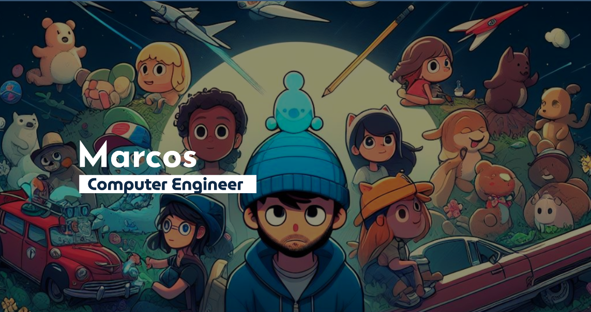

    <h1>Hi, I'm Marcos Cuellar 👋<h1>
    

## About Me 🧘🏼
### 🌐 Web Developer
### 📈 Data Science
### 💻 Computer Engineer

## Tech Stack
&nbsp;
&nbsp;
&nbsp;
&nbsp;
&nbsp;
\
&nbsp;
&nbsp;
&nbsp;
&nbsp;
&nbsp;
&nbsp;
\
&nbsp;
&nbsp;

## GitHub Stats
 

|  |  |
| --- | --- |
|  |  |
 

